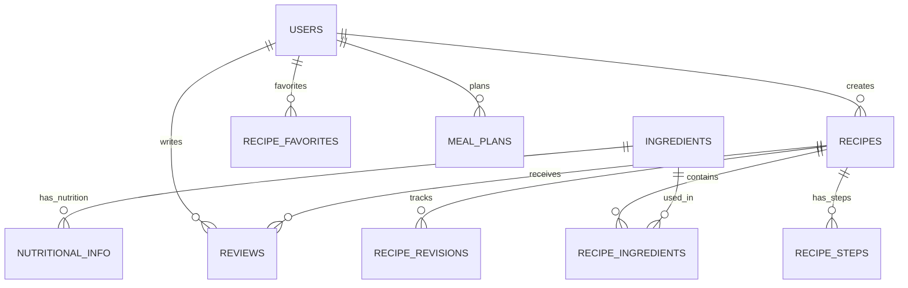

# Recipe Database

[](https://opensource.org/licenses/MIT)
[](https://www.postgresql.org/)
[](https://kubernetes.io/)
[](https://prometheus.io/)

A production-ready PostgreSQL database system for recipe management
applications, featuring comprehensive user management, recipe storage,
nutritional data, and real-time monitoring.

## 🚀 Quick Start

```bash
# 1. Deploy the main database
./scripts/containerManagement/deploy-container.sh

# 2. Load the database schema
./scripts/dbManagement/load-schema.sh

# 3. Setup monitoring (optional but recommended)
./scripts/dbManagement/setup-monitoring-user.sh
./scripts/containerManagement/deploy-supporting-services.sh

# 4. Load test data (optional)
./scripts/dbManagement/load-test-fixtures.sh
```

## 📋 Table of Contents

- [Features](#-features)
- [Architecture](#-architecture)
- [Prerequisites](#-prerequisites)
- [Installation](#-installation)
- [Configuration](#️-configuration)
- [Usage](#-usage)
- [Monitoring](#-monitoring)
- [API Reference](#-api-reference)
- [Contributing](#-contributing)
- [Security](#-security)
- [License](#-license)

## ✨ Features

### 🍳 Recipe Management

- **Complete recipe lifecycle**: Creation, editing, versioning, and deletion
- **Multi-step instructions**: Detailed cooking steps with timing information
- **Ingredient management**: Comprehensive ingredient database with nutritional
  data
- **Recipe categorization**: Tags, difficulty levels, meal types, and cuisine
  categories
- **User-generated content**: Reviews, ratings, and favorites system

### 👥 User Management

- **Role-based access control**: Admin, recipe managers, and regular users
- **Social features**: User follows, notifications, and activity feeds
- **Comprehensive preferences**: 9 categories of user customization options
- **Privacy controls**: Granular privacy settings for user profiles and content

### 📊 Data & Analytics

- **Nutritional information**: Complete nutritional data integration with
  OpenFoodFacts
- **Meal planning**: Advanced meal planning with calendar integration
- **Usage analytics**: Recipe popularity, user engagement metrics
- **Performance monitoring**: Real-time database performance insights

### 🔧 Infrastructure

- **Kubernetes-native**: Designed for cloud-native deployment
- **High availability**: Configurable replication and backup strategies
- **Monitoring ready**: Integrated Prometheus metrics and Grafana dashboards
- **Security first**: Row-level security, encrypted connections, audit logging

## 🏗 Architecture

### Database Schema Overview



### Core Entities

| Entity          | Description                 | Key Features                                         |
| --------------- | --------------------------- | ---------------------------------------------------- |
| **Users**       | User accounts and profiles  | Role-based permissions, social features, preferences |
| **Recipes**     | Recipe content and metadata | Versioning, categorization, difficulty levels        |
| **Ingredients** | Ingredient catalog          | Nutritional data, allergen information, units        |
| **Reviews**     | User-generated feedback     | Ratings, comments, moderation                        |
| **Meal Plans**  | User meal planning          | Calendar integration, nutritional goals              |

### Technology Stack

- **Database**: PostgreSQL 15.4 with advanced features
- **Container Runtime**: Docker with Kubernetes orchestration
- **Monitoring**: Prometheus + Grafana + postgres_exporter
- **Data Processing**: Python 3.x with pandas for nutritional data
- **Infrastructure**: Kubernetes with persistent volumes

## 📋 Prerequisites

### Required Software

- **Kubernetes cluster** (minikube for local development)
- **kubectl** configured for your cluster
- **Docker** for container building
- **Python 3.8+** for data processing scripts
- **PostgreSQL client tools** (psql) for database access

### System Requirements

- **CPU**: 2+ cores recommended
- **Memory**: 4GB+ available
- **Storage**: 10GB+ for database and backups
- **Network**: Outbound access for container images and data imports

### Development Tools

- **jq** for JSON processing in scripts
- **envsubst** for template processing
- **openssl** for secure password generation

## 🚀 Installation

### 1. Clone and Setup

```bash
git clone <your-repo-url>
cd recipe-database

# Copy and customize environment variables
cp .env.example .env
# Edit .env with your configuration
```

### 2. Deploy Database

```bash
# Deploy main PostgreSQL database
./scripts/containerManagement/deploy-container.sh

# Wait for deployment to be ready
kubectl wait --for=condition=Ready pod -l app=recipe-database -n recipe-database --timeout=300s
```

### 3. Initialize Schema

```bash
# Load database schema and functions
./scripts/dbManagement/load-schema.sh

# Load test data (optional)
./scripts/dbManagement/load-test-fixtures.sh
```

### 4. Setup Monitoring (Recommended)

```bash
# Create monitoring user
./scripts/dbManagement/setup-monitoring-user.sh

# Deploy monitoring infrastructure
./scripts/containerManagement/deploy-supporting-services.sh

# Verify monitoring is working
./scripts/containerManagement/get-supporting-services-status.sh
```

## ⚙️ Configuration

### Environment Variables

Create a `.env` file with the following variables:

```bash
# Database Configuration
POSTGRES_USER=recipe_admin
POSTGRES_PASSWORD=your_secure_password
POSTGRES_DB=recipe_database
DB_MAINT_USER=db_maintenance
DB_MAINT_PASSWORD=maintenance_password

# Monitoring Configuration (optional)
MONITORING_USER=postgres_exporter
MONITORING_PASSWORD=monitoring_password

# Python Data Processing
OPENFOODS_CSV_PATH=/path/to/nutritional/data.csv
```

### Kubernetes Resources

The system creates the following Kubernetes resources:

- **Namespace**: `recipe-database`
- **Deployment**: `recipe-database` (PostgreSQL + postgres_exporter)
- **Service**: `recipe-database-service` (ports 5432, 9187)
- **PVC**: `recipe-database-pvc` (persistent storage)
- **ConfigMaps**: Database and monitoring configuration
- **Secrets**: Sensitive credentials and connection strings

## 📖 Usage

### Database Access

```bash
# Connect to database directly
./scripts/dbManagement/db-connect.sh

# Port forward for external tools
kubectl port-forward -n recipe-database svc/recipe-database-service 5432:5432
```

### Common Operations

```bash
# Backup database
./scripts/dbManagement/backup-db.sh

# Import nutritional data
./scripts/dbManagement/import-nutritional-data.sh

# Export schema
./scripts/dbManagement/export-schema.sh

# Check container status
./scripts/containerManagement/get-container-status.sh
```

### Data Import

The system includes a comprehensive nutritional data importer:

```bash
# Import OpenFoodFacts data
python3 python/nutritional_data_importer/nutritional_data_importer.py \
  --csv-file /path/to/openfoodfacts.csv \
  --batch-size 1000 \
  --verbose
```

## 📊 Monitoring

### Metrics Available

The system provides comprehensive monitoring through Prometheus and Grafana:

#### Standard PostgreSQL Metrics

- Connection counts and states
- Query performance and execution time
- Buffer cache hit ratio
- Lock information and deadlocks
- Database size and table statistics

#### Recipe-Specific Business Metrics

- Recipe creation rates and trends
- User engagement and activity
- Popular recipes and ingredients
- Meal planning usage statistics

### Grafana Dashboards

Import the pre-configured dashboard:

```bash
# Dashboard location
monitoring/grafana-dashboards/postgresql-overview.json
```

### Alerting Rules

The system includes production-ready alerting rules:

- Database connectivity issues
- High connection usage (80%+ warning, 90%+ critical)
- Low cache hit ratio (<90%)
- Long-running queries (>5 minutes)
- High transaction rollback rate (>10%)

### Access Monitoring

```bash
# View metrics directly
kubectl port-forward -n recipe-database svc/recipe-database-service 9187:9187
curl http://localhost:9187/metrics

# Check monitoring status
./scripts/containerManagement/get-supporting-services-status.sh
```

## 📚 API Reference

### Database Functions

#### `create_recipe(user_id, title, description, ...)`

Creates a new recipe with ingredients and returns the recipe ID.

```sql
SELECT recipe_manager.create_recipe(
  p_user_id := 1,
  p_title := 'Chocolate Chip Cookies',
  p_description := 'Classic homemade cookies',
  p_servings := 24,
  p_prep_time := 15,
  p_cook_time := 12,
  p_difficulty := 'EASY',
  p_origin_url := null,
  p_ingredients := '[{"ingredient_id": 1, "quantity": 2, "unit": "CUP", "is_optional": false}]'::jsonb
);
```

#### `get_average_rating(recipe_id)`

Returns average rating and review count for a recipe.

```sql
SELECT * FROM recipe_manager.get_average_rating(123);
```

### Database Views

#### `recipe_summary`

Comprehensive recipe overview with ratings and favorites.

```sql
SELECT * FROM recipe_manager.recipe_summary
WHERE average_rating >= 4.0
ORDER BY favorites_count DESC;
```

#### `vw_top_rated_recipes`

Top-rated recipes across the platform.

```sql
SELECT * FROM recipe_manager.vw_top_rated_recipes LIMIT 10;
```

### Monitoring Queries

Located in `db/queries/monitoring/`:

- `recipe_metrics.sql`: Business intelligence queries
- `performance_metrics.sql`: Database performance analysis
- `health_checks.sql`: System health validation

## 🤝 Contributing

Please read [CONTRIBUTING.md](CONTRIBUTING.md) for details on our code of
conduct and the process for submitting pull requests.

### Development Setup

```bash
# Setup development environment
./scripts/containerManagement/deploy-container.sh
./scripts/dbManagement/load-test-fixtures.sh

# Run code quality checks
black python/
isort python/
flake8 python/
mypy python/
```

## 🔒 Security

This project follows security best practices. Please see
[SECURITY.md](SECURITY.md) for:

- Security policy and reporting procedures
- Supported versions and update schedule
- Security features and configurations
- Best practices for deployment

### Security Features

- **Role-based access control** with minimal privilege principles
- **Row-level security policies** for data isolation
- **Encrypted connections** with TLS support
- **Audit logging** for all database changes
- **Secure secrets management** via Kubernetes secrets
- **Network policies** for container communication

## 📄 License

This project is licensed under the MIT License - see the [LICENSE](LICENSE) file
for details.

## 🆘 Support

### Documentation

- [Setup Guide](docs/setup.md) - Detailed installation instructions
- [Operations Guide](docs/operations.md) - Day-to-day management
- [Troubleshooting](docs/troubleshooting.md) - Common issues and solutions
- [Monitoring Guide](monitoring/README.md) - Comprehensive monitoring setup

### Getting Help

- 🐛 **Bug Reports**: Use GitHub Issues with the 'bug' label
- 💡 **Feature Requests**: Use GitHub Issues with the 'enhancement' label
- 💬 **Questions**: Use GitHub Discussions for general questions
- 🔒 **Security Issues**: Follow our [Security Policy](SECURITY.md)

### Community

- **Contributors**: See [Contributors](contributors.md) for recognition
- **Changelog**: See [CHANGELOG.md](CHANGELOG.md) for version history
- **Roadmap**: Check GitHub Projects for upcoming features

---

## Made with ❤️ for the recipe management community

_This database powers recipe applications with robust data management,
comprehensive monitoring, and production-ready reliability._
